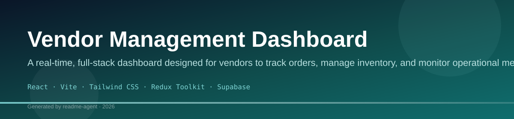
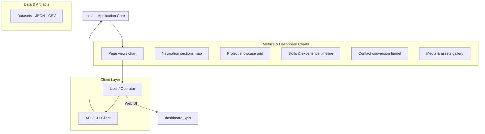
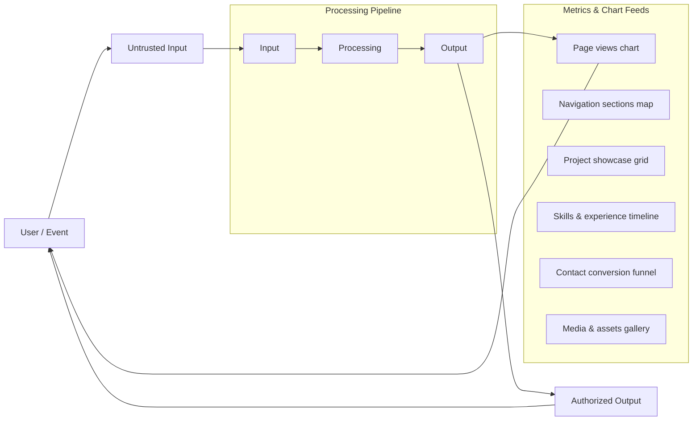
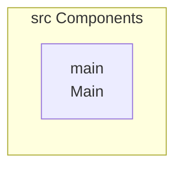
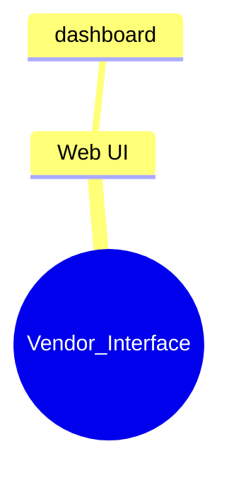
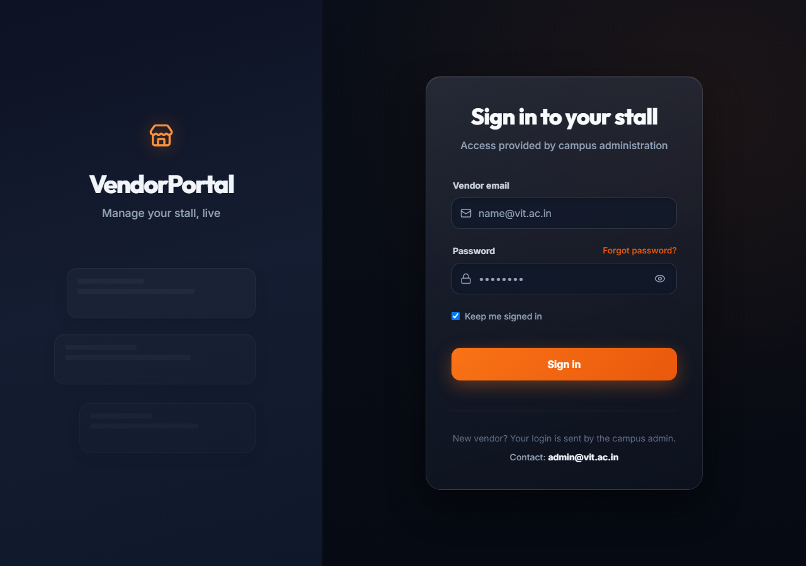
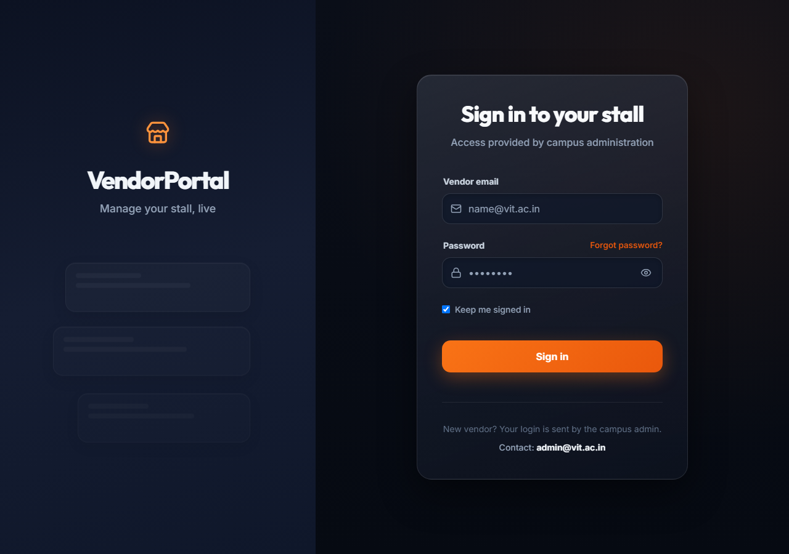

# Vendor Management Dashboard (React/Vite/Supabase)

A real-time vendor management dashboard built with React, Vite, and Supabase, designed to track orders, manage inventory, and handle vendor-specific data.

## Overview

This project is a modern single-page application (SPA) designed to serve as a vendor interface. It utilizes React 19, Vite for fast development, and Tailwind CSS for styling. The core functionality revolves around connecting to a backend powered by Supabase for database operations and real-time updates, and managing complex client-side state using Redux Toolkit. The architecture suggests a focus on user authentication, order processing, and dynamic data visualization.

## Problem

The project aims to provide a centralized, real-time dashboard for vendors to manage their operations, specifically tracking orders, viewing inventory, and accessing vendor-specific data, moving beyond simple static data display.

## Solution

The solution is a full-stack React application that integrates Supabase for backend services (Auth, Database, Realtime) and uses Redux Toolkit for predictable, global state management. The use of Socket.IO suggests the implementation of real-time communication for instant updates (e.g., order status changes).

## Key Features

- User Authentication and Authorization (via Supabase)
- Real-time Order Tracking (using Socket.IO and Supabase Realtime)
- Vendor Dashboard Overview (Metrics and Summaries)
- Inventory Management (CRUD operations)
- State Management using Redux Toolkit
- Responsive UI built with Tailwind CSS

## Technology Stack

- React
- Vite
- Tailwind CSS
- Redux Toolkit
- Supabase
- Axios
- Socket.IO

## Vendor Management Dashboard

A real-time vendor management dashboard built with React, Vite, and Supabase, designed to track orders, manage inventory, and handle vendor-specific data.

This project is a modern single-page application (SPA) designed to serve as a vendor interface. It utilizes React 19, Vite for fast development, and Tailwind CSS for styling. The core functionality revolves around connecting to a backend powered by Supabase for database operations and real-time updates, and managing complex client-side state using Redux Toolkit. The architecture suggests a focus on user authentication, order processing, and dynamic data visualization.

### 🚀 Features

*   **User Authentication and Authorization:** Secure access management implemented via Supabase.
*   **Real-time Order Tracking:** Instant updates on order status changes using Socket.IO and Supabase Realtime.
*   **Vendor Dashboard Overview:** Provides key metrics and summaries for immediate operational visibility.
*   **Inventory Management:** Full CRUD (Create, Read, Update, Delete) capabilities for managing stock.
*   **State Management:** Predictable global state handling using Redux Toolkit.
*   **Responsive UI:** Built with Tailwind CSS for a modern, adaptive user experience.

### 💡 Problem & Solution

**Problem Statement:**
The project aims to provide a centralized, real-time dashboard for vendors to manage their operations, specifically tracking orders, viewing inventory, and accessing vendor-specific data, moving beyond simple static data display.

**Solution:**
The solution is a full-stack React application that integrates Supabase for backend services (Auth, Database, Realtime) and uses Redux Toolkit for predictable, global state management. The use of Socket.IO suggests the implementation of real-time communication for instant updates (e.g., order status changes).

### ⚙️ Tech Stack & Architecture

This application follows a standard modern React SPA pattern, separating concerns into components, state management, and API interaction.

**Tech Stack:**
*   **Frontend:** React, Vite, Tailwind CSS
*   **State Management:** Redux Toolkit
*   **Backend/Database:** Supabase (Auth, Database, Realtime)
*   **Networking:** Axios, Socket.IO

**Architecture:**
The architecture separates concerns into components, state management (Redux), and API interaction (Axios/Supabase). The inclusion of `socket.io-client` indicates a dedicated real-time communication layer running alongside the standard HTTP API calls.

### 🛠️ Getting Started

#### Prerequisites

Ensure you have Node.js and npm/yarn installed.

#### Installation

1.  Clone the repository:
    ```bash
    git clone [repository-url]
    cd vendor-management-dashboard
    ```
2.  Install dependencies:
    ```bash
    npm install # or yarn install
    ```
3.  Create a `.env` file based on the provided `.env.example` and populate it with necessary keys (Supabase URL, Anon Key, etc.).

#### Configuration

Configuration is managed primarily through environment variables defined in the `.env` file. These variables include:

*   `VITE_SUPABASE_URL`: The URL for the Supabase backend.
*   `VITE_SUPABASE_ANON_KEY`: The public key for client-side Supabase access.
*   `VITE_API_KEY`: A general API key (if used outside Supabase).

#### Usage

**Running the Application:**

The application is run via the development script:
```bash
npm run dev
```

**Database Seeding (Demo Data):**

To populate the database for initial testing, use the following script:
```bash
npm run seed:demo
```

Users interact with the dashboard by logging in, viewing real-time order feeds, and managing inventory records.

### 📂 Project Structure

The structure is modular, containing dedicated folders for components, state management, API services, and hooks. Key directories include:

*   `src/components`: UI elements.
*   `src/store`: Redux logic (slices).
*   `src/services`: API/Supabase interaction.
*   `src/hooks`: Custom logic.

### ⚠️ Limitations and Future Improvements

**Current Limitations:**
*   The project structure is large, and without access to the full codebase, specific logic flaws or performance bottlenecks cannot be identified.
*   The dependency versions in `package.json` should be reviewed and potentially updated to ensure compatibility with the latest React/Vite standards.

**Future Improvements:**
*   Implement comprehensive role-based access control (RBAC) using Supabase Row Level Security (RLS) to restrict vendor access to only relevant data.
*   Develop a dedicated reporting module using a charting library (e.g., Recharts) to visualize sales trends and inventory turnover rates.
*   Refactor the API interaction layer to use a dedicated service class (e.g., `SupabaseService.js`) to encapsulate all database calls, improving testability and maintainability.
*   Add comprehensive error handling and user feedback mechanisms across all components.

## Setup Guide

### Frontend Setup

```bash

npm install
npm run dev     # development
npm run build && npm start   # production
```

Open `http://127.0.0.1:5173` (or the port shown in the terminal).

### Configuration

Copy environment templates before running:

- `.env.example` → copy to `.env` in the same directory

### Running the Application

1. **Start web app** — `npm run dev` in `./`

```bash
cd .
npm install
npm run dev
```

## System Architecture

High-level system design, data flows, API map, and workflow pipelines derived from the repository structure.

### System Architecture



### Data Flow & Charts Pipeline



### Component & API Map



### Application Page Map



## Application Pages

Screenshots captured from the running application. Each page is listed with its function.

### Application

#### Earnings

Earnings — application page at `/earnings`


#### Live Orders

Live Orders — application page at `/live-orders`


### Public

#### Login

Login — application page at `/login`



### Application

#### Menu

Menu — application page at `/menu`



#### Past Orders

Past Orders — application page at `/past-orders`


