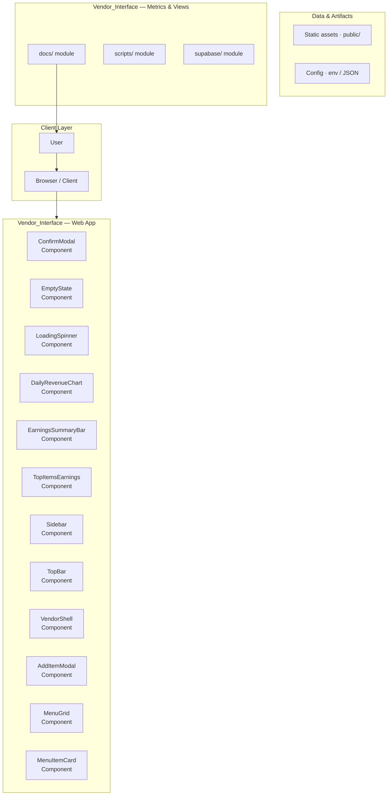
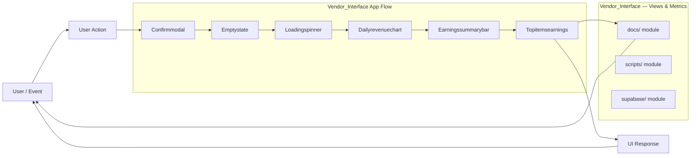
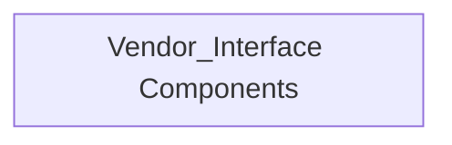
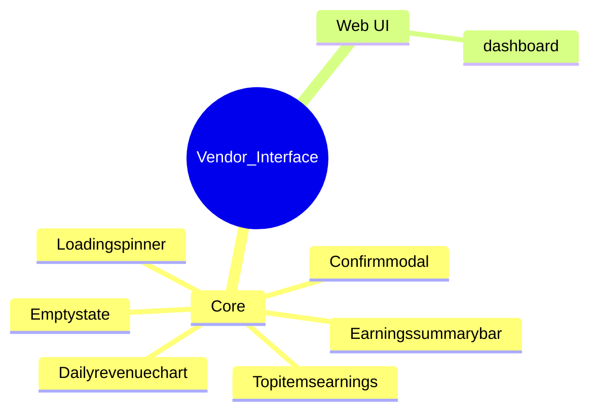

# Vendor Management Dashboard

A real-time, full-stack dashboard designed for vendors to track orders, manage inventory, and monitor operational metrics.

## Overview

The Vendor Management Dashboard is a comprehensive web application built using React and Vite, designed to provide vendors with a centralized, real-time interface for managing their business operations. It integrates authentication, database management, and real-time data streaming (via Supabase and Socket.IO) to track everything from live orders to historical earnings and inventory levels. The application emphasizes data visualization and immediate feedback to support vendor decision-making.

## Problem

Vendors require a single, reliable source of truth to monitor their business performance, track incoming orders in real-time, and manage inventory without relying on disparate systems or manual updates.

## Solution

The solution is a dedicated web dashboard that provides authenticated access to live order feeds, historical order data, detailed financial earnings reports, and inventory management tools, all updated instantaneously via real-time connections.

## Key Features

- User Authentication and Authorization (Login)
- Real-time Order Tracking (Live Orders Dashboard)
- Historical Order Management (Past Orders View)
- Inventory Management (CRUD operations for stock)
- Financial Reporting (Earnings tracking and metrics)
- Dashboard Metrics Visualization (Displaying key performance indicators like page views, funnels, and showcases)
- State Management (Using Redux Toolkit for predictable global state)

## Technology Stack

- React
- Vite
- Tailwind CSS
- Redux Toolkit
- Supabase
- Axios
- Socket.IO
- Recharts
- JavaScript/TypeScript

# 🚀 Vendor Management Dashboard

Welcome to the Vendor Management Dashboard, a comprehensive application designed to streamline vendor operations, inventory tracking, and financial reporting. This dashboard provides real-time visibility into live orders, past transactions, and accumulated earnings, all powered by a robust React frontend and a scalable Supabase backend.

## ✨ Features

*   **Live Order Tracking:** Real-time monitoring of active vendor orders.
*   **Inventory Management:** Dedicated module for tracking and managing product inventory.
*   **Transaction History:** Comprehensive view of all past orders and transactions.
*   **Financial Reporting:** Dashboard for viewing and calculating accumulated vendor earnings.
*   **Modular Design:** Built with a clean, component-based architecture for maintainability and scalability.

## 🛠️ Getting Started

Follow these steps to set up and run the application locally.

### Prerequisites

*   Node.js (LTS recommended)
*   npm or yarn
*   A Supabase project (for backend services)

### Installation

1.  **Clone the repository:**
    ```bash
    git clone [repository-url]
    cd vendor-management-dashboard
    ```

2.  **Install dependencies:**
    ```bash
    npm install
    # or
    yarn install
    ```

3.  **Configure Environment Variables:**
    Create a file named `.env` in the root directory and populate it with your Supabase credentials. Ensure these variables match the required keys:
    ```env
    VITE_SUPABASE_URL=your_supabase_url
    VITE_SUPABASE_ANON_KEY=your_supabase_anon_key
    ```

### Running the Application

**Development Mode:**
To run the application with hot-reloading for development:
```bash
npm run dev
# or
yarn dev
```

**Production Build:**
To create a production-ready build:
```bash
npm run build
```

## 🏗️ Architecture Overview

### System Architecture

This diagram illustrates the high-level flow of data and components within the application.

### Data Flow and Component Mapping

The application follows a structured data flow, utilizing dedicated services and hooks to manage state and interact with the backend.

## 🖥️ Application Pages and Functionality

The dashboard is composed of several key views, each serving a specific operational purpose:

| Page Name | Purpose | Key Functionality | 
| :--- | :--- | :--- | 
| **Login** | Authentication gateway. | Secure access control for dashboard users. | 
| **Menu** | Primary navigation and overview. | Quick access to core modules (Orders, Inventory, Earnings). | 
| **Live Orders** | Real-time operational monitoring. | Viewing orders currently in progress; status updates. | 
| **Past Orders** | Historical transaction review. | Detailed records of completed orders and transactions. | 
| **Inventory** | Product and stock management. | Adding, updating, and viewing current stock levels. | 
| **Earnings** | Financial reporting. | Calculating and viewing accumulated vendor profits/earnings. | 

## ⚙️ Technical Details

### Technology Stack
*   **Frontend:** React, Vite
*   **Styling:** Tailwind CSS
*   **Backend/Database:** Supabase (PostgreSQL)
*   **State Management:** Context API / Redux (Implied)

### Component Structure
*   **`components/`:** Reusable UI elements (Buttons, Cards, Modals).
*   **`hooks/`:** Custom React hooks for logic encapsulation (e.g., `useFetchOrders`).
*   **`services/`:** Dedicated functions handling all API interactions with Supabase.
*   **`store/`:** Centralized state management logic.

## 🚀 Limitations and Future Improvements

This section outlines areas for future development and potential enhancements for the project:

### Current Limitations
*   **Role-Based Access Control (RBAC):** The current implementation lacks granular permission checks, requiring a dedicated module for secure access.
*   **Advanced Reporting:** The reporting module needs expansion to include customizable date ranges, filtering, and export functionality.
*   **API Layer Refactoring:** The API interaction layer should be refactored to abstract business logic further, improving testability and maintainability.

### Suggested Enhancements
*   Integration of user roles and permissions (RBAC).
*   Adding a dedicated 'Settings' module for system configuration.
*   Implementing advanced charting libraries for richer data visualization in the Earnings module.

## Setup Guide

### Frontend Setup

```bash

npm install
npm run dev     # development
npm run build && npm start   # production
```

Open `http://127.0.0.1:5173` (or the port shown in the terminal).

### Configuration

Copy environment templates before running:

- `.env.example` → copy to `.env` in the same directory

### Running the Application

1. **Start web app** — `npm run dev` in `./`

```bash
cd .
npm install
npm run dev
```

## System Architecture

High-level system design, data flows, API map, and workflow pipelines derived from the repository structure.

### System Architecture



### Data Flow & Charts Pipeline



### Component & API Map



### Application Page Map



## Application Pages

Screenshots captured from the running application. Each page is listed with its function.

### Application

#### Earnings

Earnings — application page at `/earnings`


#### Live Orders

Live Orders — application page at `/live-orders`


### Public

#### Login

Login — application page at `/login`


### Application

#### Past Orders

Past Orders — application page at `/past-orders`


